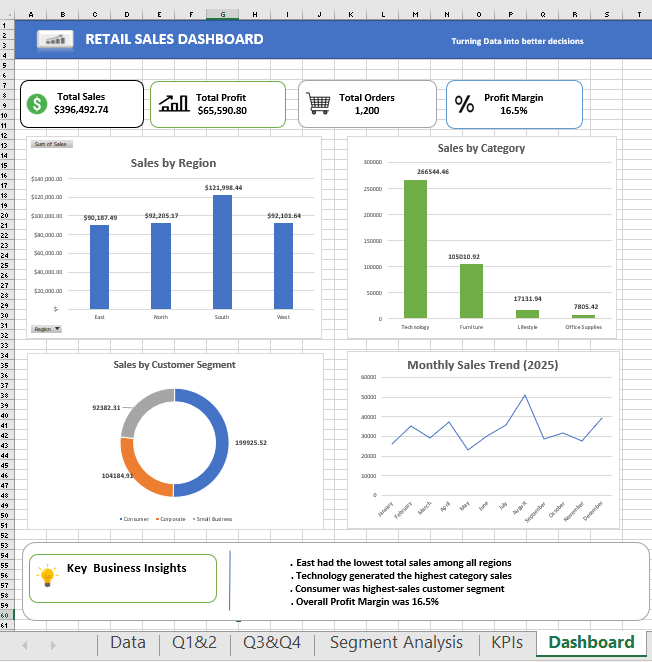

# Business Analytics Sales Dashboard

## Project Overview

This is my first Business Analytics portfolio project. The project analyzes sales data using Microsoft Excel and MySQL to identify important sales and profit trends.

## Tools Used

- Microsoft Excel
- MySQL
- Pivot Tables
- Excel Dashboard
- SQL

## Project Work

- Cleaned and analyzed sales data
- Created KPIs and Pivot Tables
- Performed SQL-based analysis
- Built an interactive Excel dashboard
- Identified key sales and profit insights
- Provided business recommendations

## Key Findings

- East region had the lowest sales.
- 24 inch monitor was the highest-selling product.
- Total profit was $65,590.
- Total discount amount was $24,832.

## Files Included

- Excel Analysis.xlsx – Excel analysis and dashboard
- SQL Analysis.sql – SQL queries and analysis
- Project Documentation.docx – Complete project documentation

## Conclusion

This project demonstrates my basic skills in data analysis, Excel, SQL, data visualization, and business insights.

## Dashboard Preview

